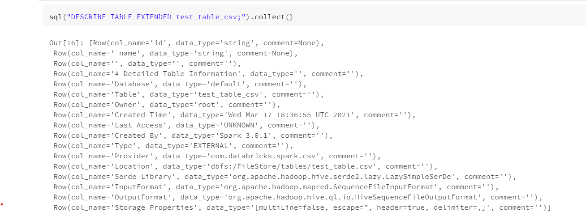

# Databricks & JDBC 

## External Hive Databricks Metastore

Create Databricks cluster with External Hive Databricks Metastore 

sample Spark config as below with Azure SQL Server

```
javax.jdo.option.ConnectionPassword <password>
javax.jdo.option.ConnectionURL jdbc:sqlserver://<sql_server_name>.database.windows.net:1433;database=<db_name>
spark.master local[*]
spark.databricks.cluster.profile singleNode
spark.sql.hive.metastore.jars builtin
javax.jdo.option.ConnectionDriverName com.microsoft.sqlserver.jdbc.SQLServerDriver
spark.sql.hive.metastore.version 2.3.7
javax.jdo.option.ConnectionUserName <username>
datanucleus.autoCreateSchema true
datanucleus.fixedDatastore false 
hive.metastore.schema.verification false
hive.metastore.schema.verification.record.version false
```

If everything goes well, it will automatically create tables in SQL Server with external Hive Metastore.

We may also connect SQL Server and run the query below to get the information of databases and tables

```
sql
SELECT * FROM sys.databases [where name = '<table_name>']
```

Reference:

* [Metastore — Databricks Knowledge Base](https://kb.databricks.com/metastore/index.html)
* [External Apache Hive metastore — Databricks Documentation](https://docs.databricks.com/data/metastores/external-hive-metastore.html)
* [setup_metastore_jars - Databricks](https://docs.microsoft.com/en-us/azure/databricks/_static/notebooks/setup-metastore-jars.html)
* [Create Hive external metastore using azure sql db - YouTube](https://www.youtube.com/watch?v=5iLgyeFxPwc)


## Link Collibra and Databricks with JDBC Driver
* Step 1: Register Data Source at Collibra "Create" -> "Register Data Source"
* Step 2: Select/Upload JDBC driver
* Step 3: Enter appropriate information of Databricks’ cluster

Reference:

* [Get JDBC Driver file: JDBC Drivers Download - Databricks](https://databricks.com/spark/jdbc-drivers-download)
* [Demo: Collibra for Databricks - YouTube](https://www.youtube.com/watch?v=A4X3PEfa5fc)

## Fetch table metadata using Databricks notebook 
Run below SparkSql query 

```
sql('DESCRBE TABLE EXTENDED <table_name>').collect()
```


## Connect Databricks Remotely with Python library (PySpark/Databricks-Connect) 

System requirement:

* [Databricks clusters and workspaces have been ready](https://docs.databricks.com/workspace/workspace-details.html)
* PySpark or databricks-connect installed

    - Install Spark with Hadoop PySpark
    
        1. Download Spark at [Downloads | Apache Spark](https://spark.apache.org/downloads.html)	
        2. Unzip the tgz file to C:\\Users\\<u_id> folder and the files would under the directory like C:\\Users\\<u_id>\\spark-3.1.1-bin-hadoop2.7 
        3. Select appropriate Hadoop version at [GitHub](https://github.com/steveloughran/winutils) and download the winutils.exe file ONLY which is under winutils/hadoop-<version>/bin/
        4. Copy/Move the downloaded winutils.exe file to spark bin folder like C:\\Users\\<u_id>\\spark-3.1.1-bin-hadoop2.7\bin
        5. Setup Environment Variables, for example:
            ```
            PYTHON_PATH=C:\Users\<u_id>\AppData\Roaming\Python\Python37
            HADOOP_HOME=C:\Users\<u_id>\spark-3.1.1-bin-hadoop2.7    
            JAVA_HOME=C:\Users\<u_id>\Java\jdk1.8.0_242
            SPARK_HOME=C:\Users\<u_id>\spark-3.1.1-bin-hadoop2.7
            PYSPARK_PYTHON=%PYTHON_PATH%
            PYSPARK_DRIVER_PYTHON=C:\Users\<u_id>\Downloads\SimbaSparkJDBC42-2.6.17.1021\SparkJDBC42.jar
            ```

    - Install databricks-connect package
        1. Install the package using pip
            ```
            pip install -upgrade -user databricks-connect==<Databricks Runtime Version> 
            ```
        2. Make configuration using command
            ```
            databricks-connect configure 
            ```
            Details of information may be found [here](https://docs.databricks.com/workspace/workspace-details.html)
        3. Test connection using command  
            ```
            databricks-connect test 
            ```
        
#### Known issue:

* The PySpark version of databricks-connect may conflict with others. 

    Solutions:

    * Either remove other version of PySpark by ‘pip uninstall pyspark’
        
    * Or install in different virtual environment with appropriate Environment Variables   

* PySpark and databricks-connect could execute some general SparkSql queries like select, update, delete etc. But will get error when executing some spark sql queries like ‘’ DESCRIBE TABLE EXTENDED <table_name>;” 

Reference:
* [Databricks Connect - Azure Databricks - Workspace | Microsoft Docs](https://docs.microsoft.com/en-us/azure/databricks/dev-tools/databricks-connect)

## Connect Databricks Remotely with Databricks REST API (Databricks CLI or script)
* Use Databricks CLI to control Databricks notebooks and get the results
* Use script base on Databricks REST API 2.0 to execute SparkSql query “DESCRIBE TABLE EXTENDED <table_name>” 

Reference:
* [Databricks CLI — Databricks Documentation](https://docs.databricks.com/dev-tools/cli/index.html)
* [REST API 2.0 - Azure Databricks - Workspace | Microsoft Docs](https://docs.microsoft.com/en-us/azure/databricks/dev-tools/api/latest/)
* [Get Databricks Results Locally](https://jixjia.com/get-databricks-results-locally/)
